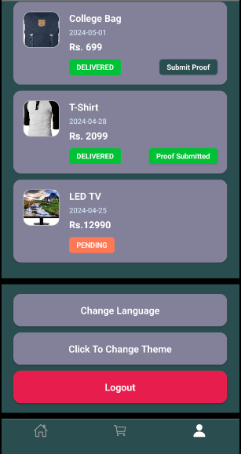

# 🛍️ MyEComm – React Native eCommerce App

A mobile eCommerce app built with React Native CLI as part of a take-home assignment. It features a product catalog, cart system, user authentication, and a native Android camera bridge for proof-of-delivery.

## 🚀 Features

- 🔐 Login/Registration using DummyJSON API
- 🏠 Product Catalog with category filters
- 🛒 Cart system with quantity controls and total
- 📦 Proof of Delivery using native Android camera (via custom bridge)
- 🎨 Theme switching (Light/Dark) with Zustand
- ✅ Persistent cart via Zustand + AsyncStorage
- 🧪 Unit-tested global store
- 📁 Clean architecture and folder structure

## 📸 Native Android Camera Integration

- Camera access is done via a native Kotlin module
- Bridged to React Native using a custom JS interface
- Returns a photo URI which is shown and submitted from the Proof screen

## 📂 Folder Structure (Assignment-Compliant)

```
MyEComm/
├── android/app/src/main/java/com/myecomm/CameraModule.kt
├── src/
│   ├── bridges/CameraModule.ts
│   ├── core/                  # Zustand stores themeValue and cartItems, asyncStorage user/session mgmt
│   ├── hooks/                 # custom hooks for handling CameraModule
│   ├── services/              # API wrappers
│   ├── navigation/ 
│   ├── components/            # UI components
│   ├── screens/               # Screen-level components
│   ├── constants/theme.ts     # themes & colors
│   ├── config/                # Environments (dev, test, prod)
└── README.md
```


## 📸 Screenshots

- Product list


- Product list on the basis of category


- Cart


- Proof of delivery


- Theme changer



## 📐 Architecture Diagram

A high-level architecture diagram is included in `/docs/MyEComm_Architecture`, covering:

- Screen navigation (Stack and Tab)
- Native camera bridge
- Zustand store layers

## ✅ Tested Devices

- ✅ Android: Pixel 7, Samsung Galaxy tab A.
- ✅ iOS (except camera feature): iPhone 13 simulator

## 📦 Tech Stack

- React Native CLI (TS)
- Zustand for global state
- DummyJSON API
- Native Android module (Java)
- Jest for unit tests
- AsyncStorage for persistence

## 🙋 Author

Neeraj  
_Associate Software Engineer | React Native Developer_
